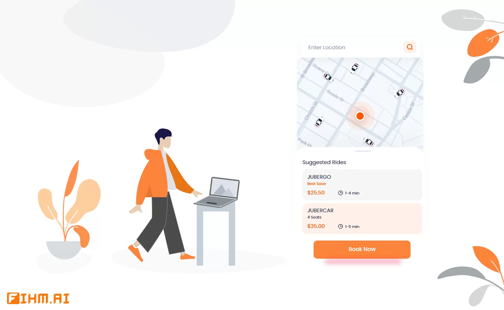

# [تحليل رحلات أوبر باستخدام بايثون | Uber Trips Analysis using Python](https://fihm.ai/tutorials/uber-trips-analysis-using-python/)

محتويات الدرس📄 

التحليل الاستكشافي للبياناتEDA

ملاحظة : البيانات المستخدمة في الدرس يمكن تحميلها من خلال الدرس أدناه.

رابط الدرس🔗: 
https://fihm.ai/tutorials/uber-trips-analysis-using-python/

